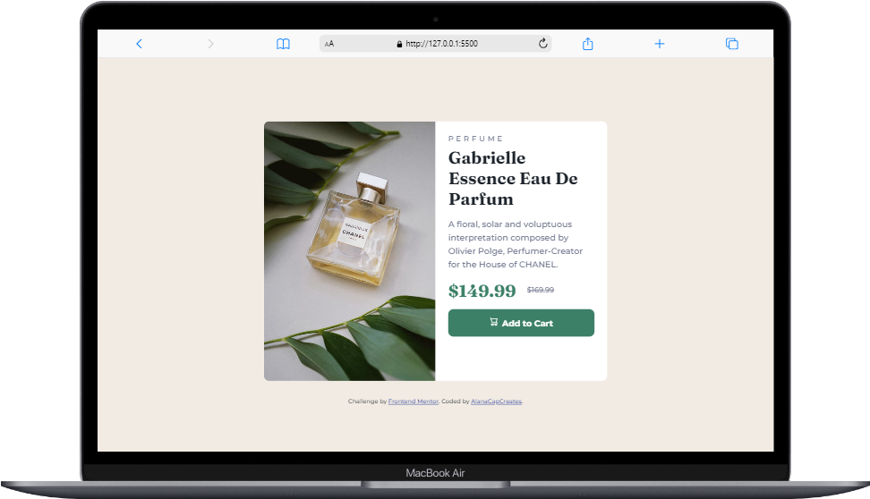
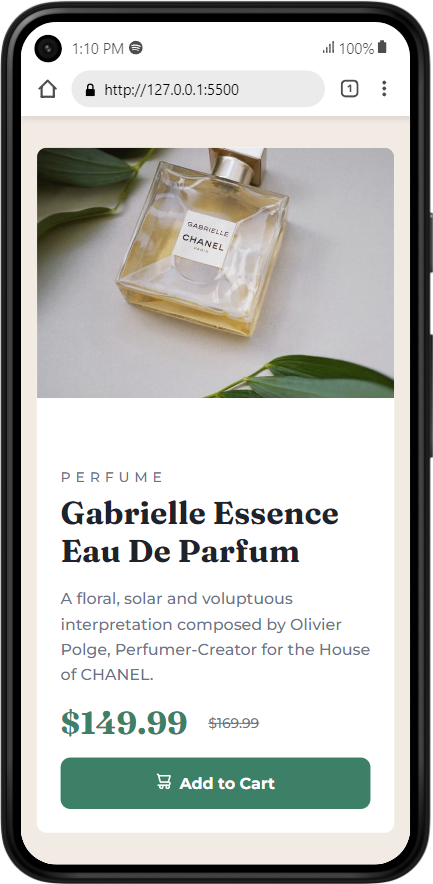

# Frontend Mentor - Product preview card component solution

This is a solution to the [Product preview card component challenge on Frontend Mentor](https://www.frontendmentor.io/challenges/product-preview-card-component-GO7UmttRfa). Frontend Mentor challenges help you improve your coding skills by building realistic projects. 

## Table of contents

- [Overview](#overview)
  - [The challenge](#the-challenge)
  - [Screenshot](#screenshot)
  - [Links](#links)
- [My process](#my-process)
  - [Built with](#built-with)
  - [Useful resources](#useful-resources)
- [Author](#author)
- [Acknowledgments](#acknowledgments)

## Overview

### The challenge

Users should be able to:

- View the optimal layout depending on their device's screen size
- See hover and focus states for interactive elements

### Screenshot

#### Desktop

#### Mobile

### Links

- Solution URL: [https://www.frontendmentor.io/solutions/product-preview-card-component-using-css-grid-8-v21E38-I](https://www.frontendmentor.io/solutions/product-preview-card-component-using-css-grid-8-v21E38-I)
- Live Site URL: [https://acc-fm-product-preview-card-component.netlify.app/](https://acc-fm-product-preview-card-component.netlify.app/)

## My process

### Built with

- Semantic HTML5 markup
- CSS custom properties
- Flexbox
- CSS Grid
- Mobile-first workflow

### Useful resources
- [CSS Grid Layout - MDN](https://developer.mozilla.org/en-US/docs/Web/CSS/CSS_Grid_Layout) - This was an overview on CSS Grid so I can try to understand the properties used.
- [CSS Grid Layout Tool](https://grid.layoutit.com/) - This helped me visualize how to create a CSS Grid. I really liked this, and will use it going forward to help understand Grid.
- [Preventing a Grid Blowout](https://css-tricks.com/preventing-a-grid-blowout/) - This is an amazing article which helped me debug why my image was overflowing my top row.

## Author

- Website - [https://alanacapcreates.com](https://alanacapcreates.com)
- Frontend Mentor - [@alanacapcreates](https://www.frontendmentor.io/profile/alanacapcreates)
- Twitter - [@alanacapcreates](https://www.twitter.com/alanacapcreates)

## Acknowledgments

Thank you to those who watched and contributed in my Twitch livestream!! I couldn't have done it without you!

